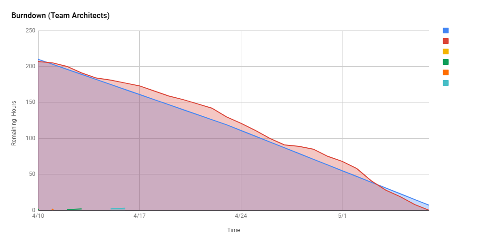

    <image src="images/uno_logo.png"  width="480" height="auto">

# UNO
A two-player card game in which the objective is to be the first player to get rid of all the cards in their hand. 

Each player is dealt 7 cards and players take turn playing or drawing cards from the deck.

## About
- It's a User vs Computer game, where both players are dealt 7 cards initially. The remainder of the cards are placed as a deck by the side.
- The cards have a combination of two properties:
  - Color
  - Type
- A card will be any of the following four colors:
  - Red
  - Blue
  - Yellow
  - Green
- Along with color, a card can be either of the two types:
    - Number Card
    - Special Card
- The Number Cards are simple cards with a value from 0-9.
- The Special Cards are cards without a value, but each has a special action attached to it. There are 3 types of special cards:
  - Skip: When played, the next player's turn is skipped.
  - Reverse: When played, the direction of play is reversed.
  - Draw 2: When played, the next player must draw two cards and loses his/her turn to play.
- The first round starts with the Computer playing a card at random.
- For each successive turn, the player has to play a card which should atleast match either the number or the color or the special action.
- In a case where a player has no playable card, he/she is bound to draw a card from the deck.
- If the card drawn from deck is playable, the card is played or else is added to the player's cards.
- In case of a special card been played, the permissible action of the next player is determined by the type of the special card.
- The objective of the game is to be the first player to get rid of all the cards in one's hand.

## Steps to Launch
- Install [Greenfoot](https://www.greenfoot.org/download)
- Clone or download this repository
- Launch `project.greenfoot` inside src/com/architects/uno directory

## User Story Video
<a href="https://www.kapwing.com/videos/627fe667bd647500d421bea4"><image src="images/thumbnail_use_story.png"></a>

## Demo Video
<a href="https://www.kapwing.com/videos/62801526fce84b00cd7ffda1"><image src="images/thumbnail_demo.png"></a>

## Game Screens:
The game consists of only 3 screens:
  1. Start Screen
  2. Game Screen
  3. Game Over Screen

## Start Screen or Main Menu Screen:
 

    <image src="images/main_menu_screen.png">

 

## Game Screen:
 

    <b>Training Mode OFF</b>

    <image src="images/game_screen.png">

 
 

    <b>Training Mode ON</b>

    <image src="images/game_screen_training.png">

 

## Game Over Screen:
 

    <image src="images/game_over_screen.png">

 
## Wireframes

|  Screen          | Wireframe                                           |
| ---------------- | --------------------------------------------------- |
| Main Screen      |      |
| Game Screen      |       |
| Game Over Screen |  |
    
 

## Technologies
- Java
- Greenfoot
  
## Team Members
1. Ashutosh Ojha
2. Devansh Modi
3. Hanyu Hu
4. Paramjot Singh
5. Waqas Kureshy

## Design Patterns

1.  Factory Pattern - Paramjot
  
  
  The factory pattern is utilized in the course of the creation of Card objects, as it significantly simplifies the process of Card creation. The diagram is presented here.
 

    <image src="images/factorypattern.png">

 
  As the diagram indicates, this Factory pattern follows the basic plan set out by the Gang of Four. In particular, the code is written in such a way that the Card creation method is obfuscated with the option of two additional creation methods. This allows for a single interface to be used by the other classes to create both SpecialCard and NumberCard objects. In short, the synonymous methods all named createCard makes the usage of CardFactory extremely easy. This was done so people using this Factory class would not need to worry about managing different methods to create the two kinds of Card objects.
    
2. Deck Singleton Pattern - Paramjot
We chose to use a Singleton pattern in order to manage the Deck. The Deck object itelf is used to manage Card objects which are not associated with either Player. This allowed us to ensure one source of Cards would exist, and no chances of duplicate cards is present. The GameRules and other classes access the Deck object by use of the getInstance method.

We present the Deck Singleton UML Diagram:

 

    <image src="images/decksingletonpattern.png">

 

### Singleton - GameRules

 

    <image src="images/singleton_pattern_game_rules.png">

 

- We chose to use a Singleton pattern for Game Rules to ensure one source of Game Rules for all players. 
- This allows IPlayer.java objects to manipulate the games using a single source.

### Singleton - GameRules

 

    <image src="images/singleton_pattern_player_rules.png">

 

- We chose to use a Singleton pattern for Player Rules to differentiate game level rules vs player level rules.
- This also ensure one source of Player Rules like draw, reverse, skip for all players.
- This allows IPlayer.java objects to manipulate the games using a single source.

### Observer Pattern

 

    <image src="images/observer_pattern.png">

 

- Observer pattern was a good fit for sound effects as we needed multiple tracks of sound. 
- We added ISoundObserver, ISoundSubject, and SoundHandler for this pattern. 
- Any ISoundSubject can notify the SoundHandler to play SoundEvent enum based events. 
- We also have a STOP event. 

### State Pattern

 

    <image src="images/state_pattern.png">

 

### Strategy Pattern

 

    <image src="images/strategy_pattern.png">

 

- The game has two types of players:
  - Computer
  - User
- Both types of Players have common core actions:
  - Play a card
  - Draw from deck, check the card and play
- The common actions are defined by an interface `IPlayer` which is implemented by a class `Player`.
- Since, there actions are all same, both of the players are objects of class `Player`
- The only variability is in the way the players perform these actions, i.e., the `strategy` employed by the Players.
- Hence, `Strategy` pattern is used to encapsulate and implement the variabilities between the behavior of both Players.
- Three entities are defined to successfully implement the Strategy pattern:
  - interface `IPlayerStrategy`
  - class `ComputerStrategy`
  - class `UserStrategy`
- The interface specifies the variabilities to be implemented for a Player.
- Two classes are created which implement the strategies for a Computer and a User player respectively.
- In a nutshell, both Computer and User players are of the type `Player`, and it's the strategy employed that differentiates between the two players.

### Contributions

| Member | Design Pattern |
| -------------- | -------------------------------- |
| Ashutosh Ojha  | Strategy                         |
| Devansh Modi   | Observer, Singleton(PlayerRules) |
| Hanyu Hu       | Singleton(GameRules)             |
| Paramjot Singh | Factory, Singleton(Deck)         |
| Waqas Kureshy  | Singleton(GameScreen), State     |

## Class Diagram

 

    <image src="images/class_diagram.png">

 

## Journals
1. [Ashutosh's Journal](/member-journals/journal_ashutosh.md)
2. [Devansh's Journal](/member-journals/journal_devansh.md)
3. [Hanyu's Journal](/member-journals/journal_hanyu.md)
4. [Paramjot's Journal](/member-journals/journal_paramjot.md)
5. [Waqas's Journal](/member-journals/journal_waqas.md)

## Burndown Chart
### 
